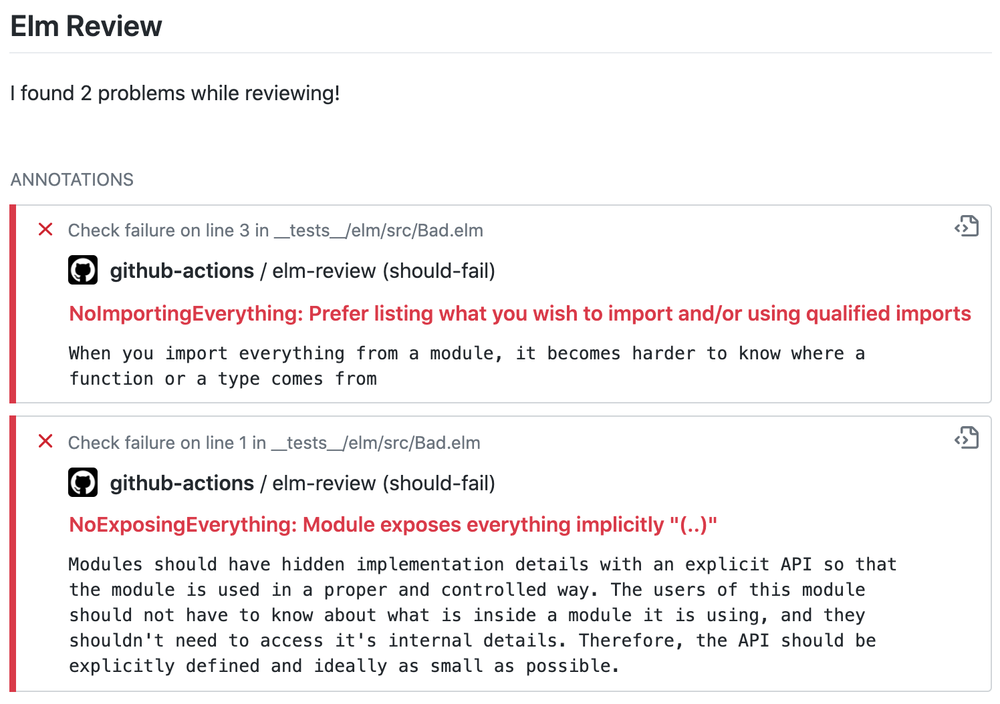
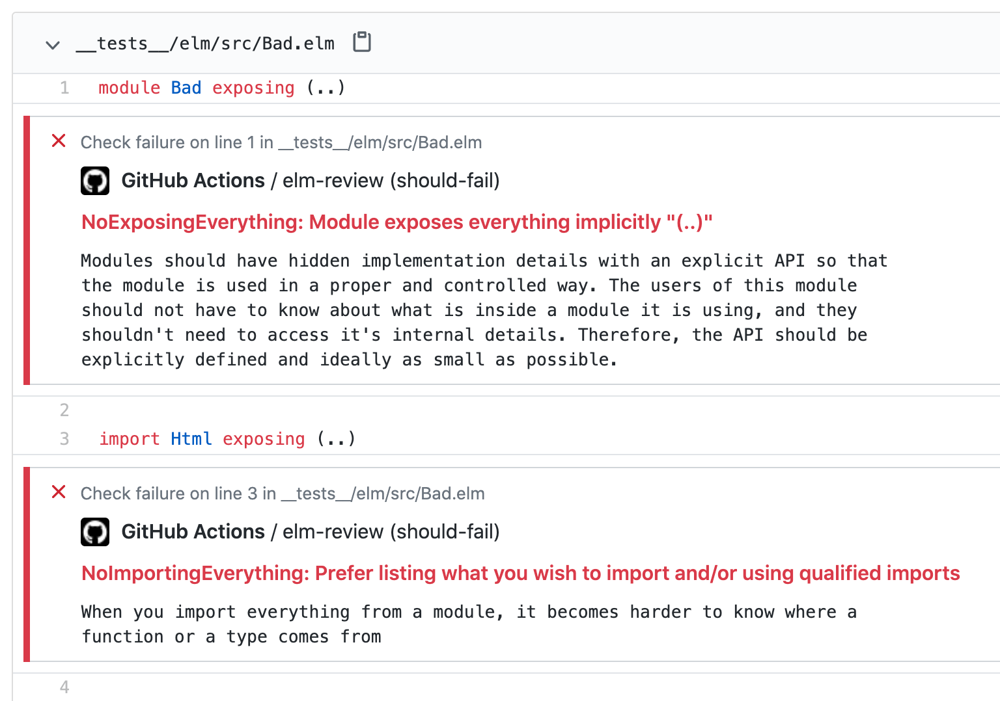

[](https://github.com/sparksp/elm-review-action/actions)

# Elm Review

Check the quality of your [Elm] code using [elm-review] in a GitHub workflow - any reports found will be added as annotations on your files.

[Elm]: https://elm-lang.org/
[elm-review]: https://github.com/jfmengels/node-elm-review


## Check Summary

This view shows in your pull request checks or repository actions. You can see a [working example of some failed checks](https://github.com/sparksp/elm-review-action/runs/727935056?check_suite_focus=true).




## Annotations

This is the view of "files changed" in a pull request with the elm-review annotations shown inline. Errors can show up in files even if you didn't change them in the pull request, as they could be a side effect of your changes.




## Finding elm-review

You must have `elm-review`, `elm-format` and the `elm` compiler available in your build, here is an example using `add-path` for when they're all dependencies in `package.json`.

```yaml
jobs:
  lint:
    steps:
    - uses: actions/checkout@v2
    - run: yarn --frozen-lockfile
    - name: Add elm-review, elm and elm-format to path
      run: echo ::add-path::$(yarn bin)
    - uses: sparksp/elm-review-action@v1
      with:
        # elm_review: elm-review
        # elm_format: elm-format
        # elm_compiler: elm
```


## Configuration

The default options are probably sufficient for most people's needs, however we understand that your set up may be different. You can use the options details below to specify the paths for `elm-review`, `elm-format` and the `elm` compiler; to locate your project's `elm.json` or `review/` folder, and to specify a custom list of files to review.  You can also customise the check name that shows up.

This snippet shows an example of what the option defaults are like, however there's more going on behind the scenes to establish the proper default for some values.

```yaml
    - uses: sparksp/elm-review-action@v1
      with:
        # name: elm-review
        # elm_review: elm-review
        # elm_compiler: elm
        # elm_format: elm-format
        # elm_review_config: review
        # elm_json: elm.json
        # elm_files: |
        #   src/
        #   tests/
```


### name

This action creates its own entry in the checks called "elm-review", you can change the check name shown with this input.


### elm_review

Specify the path to `elm-review`.


### elm_compiler

Specify the path to the `elm` compiler.


### elm_format

Specify the path to `elm-format`.


### elm_review_config

Use the `review/` configuration in the specified directory instead of the one found in the current directory or one of its parents.


### elm_json

Specify the path to the elm.json file of the project. By default, the one in the current directory or its parent directories will be used.


### elm_files

List of Elm files or directories you wish to review.  Unless files or directories are specified, `elm-review` will look at:
- For packages: `src/` and `tests/`
- For applications: the `source-directories` in the project's `elm.json` and `tests/`
